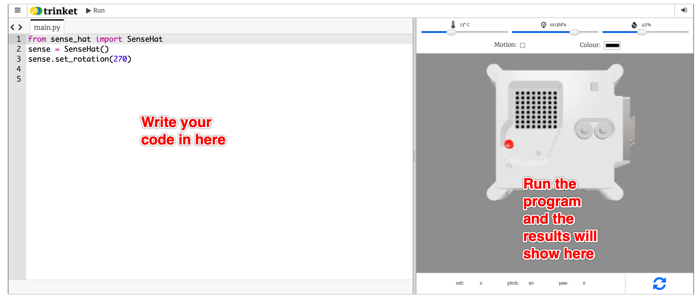

## No-print, print-only, and page break

These three blocks control how content appears in print and PDF outputs.

---

## No-print

Content inside a no-print block is visible on screen but hidden when printing or exporting to PDF. Use it for interactive embeds, videos, and editor links that have no meaning in a printed worksheet.

### Raspberry Flavoured Markdown

📖 [RFM spec — No-print](http://digital-docs.rpf-internal.org/docs/technology/codebases-and-products/raspberry-flavoured-markdown/specs/raspberry-flavoured-markdown-draft-spec#no-print)

```markdown
> [!NOPRINT]
>
> [Open the weather station starter project in the editor](https://editor.raspberrypi.org/en/projects/weather-station)
```

> [!NOPRINT]
>
> [Open the weather station starter project in the editor](https://editor.raspberrypi.org/en/projects/weather-station)

### Kramdown RPF legacy

📖 [Kramdown spec — No print](http://digital-docs.rpf-internal.org/docs/technology/codebases-and-products/raspberry-flavoured-markdown/specs/kramdown_rpf-legacy-spec#no-print)

```markdown
--- no-print ---

[Open the weather station starter project in the editor](https://editor.raspberrypi.org/en/projects/weather-station)

--- /no-print ---
```

--- no-print ---

[Open the weather station starter project in the editor](https://editor.raspberrypi.org/en/projects/weather-station)

--- /no-print ---

---

## Print-only

Content inside a print-only block is visible only when printing or exporting to PDF. Use it to provide static alternatives to interactive content — for example, a screenshot in place of an embedded editor or video.

### Raspberry Flavoured Markdown

📖 [RFM spec — Print-only](http://digital-docs.rpf-internal.org/docs/technology/codebases-and-products/raspberry-flavoured-markdown/specs/raspberry-flavoured-markdown-draft-spec#print-only)

```markdown
> [!PRINTONLY]
>
> 
```

> [!PRINTONLY]
>
> 

### Kramdown RPF legacy

📖 [Kramdown spec — Print only](http://digital-docs.rpf-internal.org/docs/technology/codebases-and-products/raspberry-flavoured-markdown/specs/kramdown_rpf-legacy-spec#print-only)

```markdown
--- print-only ---


--- /print-only ---
```

--- print-only ---


--- /print-only ---

---

## Page break

A page break forces a new page when printing or exporting to a PDF worksheet. Place it between sections to ensure clean page layout in printed output.

### Raspberry Flavoured Markdown

📖 [RFM spec — Page break](http://digital-docs.rpf-internal.org/docs/technology/codebases-and-products/raspberry-flavoured-markdown/specs/raspberry-flavoured-markdown-draft-spec#page-break)

```markdown
This content appears before the page break.

{.page-break}

This content appears on a new page after the break.
```

This content appears before the page break.

{.page-break}

This content appears on a new page after the break.

### Kramdown RPF legacy

📖 [Kramdown spec — New page](http://digital-docs.rpf-internal.org/docs/technology/codebases-and-products/raspberry-flavoured-markdown/specs/kramdown_rpf-legacy-spec#new-page)

```markdown
First page content.

--- new-page ---

Second page content.
```

First page content.

--- new-page ---

Second page content.
